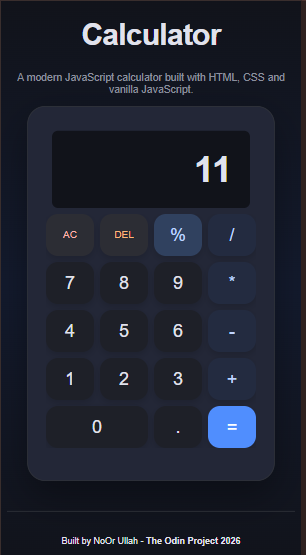

# Calculator

A modern and responsive calculator built with HTML, CSS, and Vanilla JavaScript as part of The Odin Project Foundations Course. It supports basic arithmetic operations, chained calculations, keyboard inputs, decimal handling, and robust error management.

## Preview



---

## Features

- Perform basic arithmetic operations:
  - Addition (+)
  - Subtraction (-)
  - Multiplication (*)
  - Division (/)
  - Modulus (%)

- Supports chained calculations.
- Decimal number support.
- Prevents multiple decimal points in a number.
- Division by zero error handling.
- Delete (DEL) functionality.
- All Clear (AC) functionality.
- Keyboard support for all calculator operations.
- Floating-point precision handling.
- Responsive design for desktop, tablet, and mobile devices.
- Clean and modern dark-themed UI.

---

## Keyboard Shortcuts

| Key | Action |
|-----|--------|
| 0 - 9 | Digits |
| + | Addition |
| - | Subtraction |
| * | Multiplication |
| / | Division |
| % | Modulus |
| . | Decimal Point |
| Enter or = | Calculate Result |
| Backspace | Delete |
| Escape or C | Clear Display |

---

## Technologies Used

- HTML5
- CSS3
- Vanilla JavaScript (ES6+)
- Flexbox
- CSS Grid
- Responsive Design Principles

---

## Project Structure

```
calculator/
│
├── assets/
│     └── screenshot.png
│
├── index.html
├── style.css
├── script.js
└── README.md
```

---

## What I Learned

While building this project, I practiced and strengthened my understanding of:

- DOM Manipulation
- Event Handling
- JavaScript Functions
- State Management
- Conditional Logic
- Keyboard Events
- Error Handling
- Responsive Web Design
- CSS Grid & Flexbox
- Floating-point precision handling
- Writing cleaner and maintainable JavaScript code

---

## Future Improvements

Some possible enhancements include:

- Scientific calculator functionality.
- Calculation history.
- Theme switcher (Dark/Light mode).
- Percentage and advanced mathematical operations.
- Keyboard animations and sound effects.
- Unit conversion support.

---

## Getting Started

1. Clone the repository.

```bash
git clone https://github.com/your-username/calculator.git
```

2. Navigate to the project folder.

```bash
cd calculator
```

3. Open `index.html` in your browser.

No additional dependencies or installations are required.

---

## Acknowledgements

This project was built as part of **The Odin Project Foundations Course**.

- https://www.theodinproject.com/

---

## Author

**NoOr Ullah**

Frontend Developer | IT Student | Full-Stack & AI Enthusiast

GitHub: https://github.com/Noorullah814

---

### Built with ❤️ by NoOr Ullah – The Odin Project 2026
