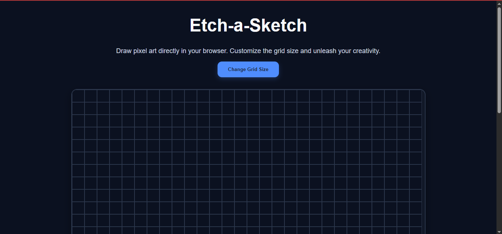
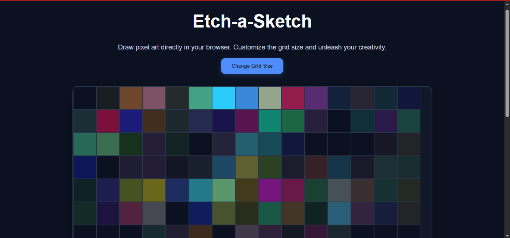
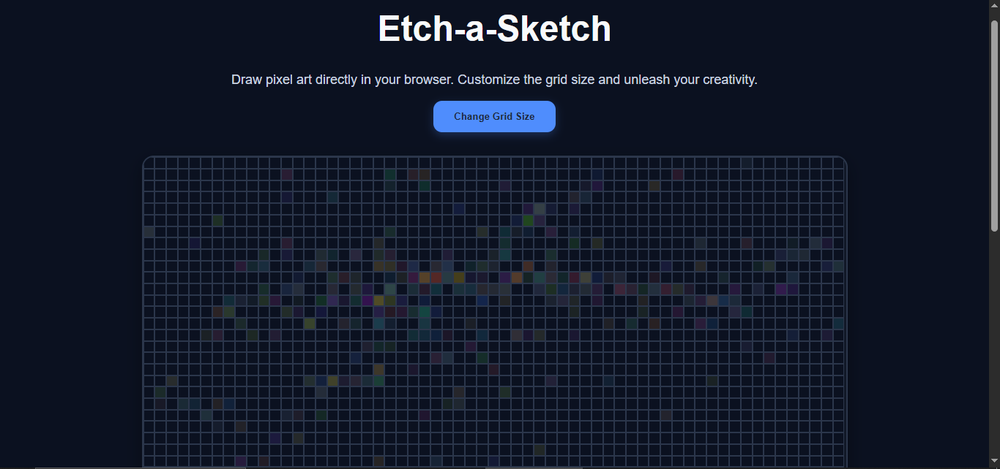

# Etch-a-Sketch

A modern browser-based Etch-a-Sketch application built with HTML, CSS, and JavaScript as part of The Odin Project Foundations curriculum.

Users can generate custom-sized drawing grids, sketch by hovering over cells, and enjoy colorful drawing effects with progressive darkening.

## ✨ Features
🎨 Interactive drawing by hovering over grid cells
📏 Dynamic grid sizes (1 × 1 up to 100 × 100)
🌈 Random RGB color generation
🌑 Progressive darkening effect (10 hover interactions to full opacity)
✅ Input validation for custom grid sizes
📱 Responsive layout for desktop, tablet, and mobile
💎 Clean SaaS-inspired modern UI
🛠️ Built With
- HTML5
- CSS3 (Flexbox)
- JavaScript (DOM Manipulation)

## 📚 Concepts Practiced
DOM manipulation
Dynamic element creation
Event listeners
Mouse events
CSS Flexbox
Responsive design
JavaScript functions
Data attributes (dataset)
User input validation
Dynamic styling with JavaScript

## 📷 Preview

## 🎯 Learning Outcomes

This project strengthened my understanding of:

Creating elements dynamically with JavaScript
Managing large numbers of DOM elements efficiently
Building responsive layouts using Flexbox
Handling user interactions through mouse events
Working with custom data attributes
Applying dynamic styles programmatically
📂 Project Structure
etch-a-sketch/
│
├── index.html
├── style.css
├── script.js
└── README.md
🙌 Acknowledgements

This project was completed as part of The Odin Project Foundations Course.

Built with ❤️ by NoOr Ullah