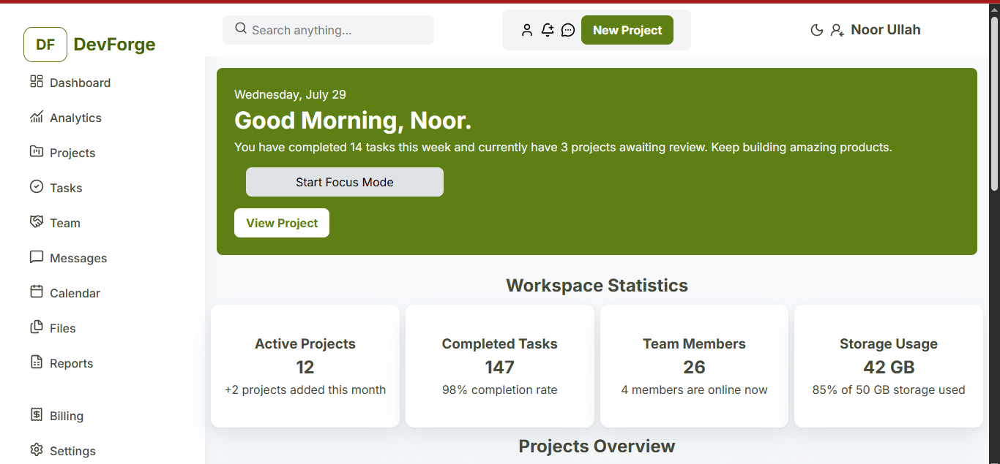

# DevForge Admin Dashboard

A modern and responsive developer-focused admin dashboard built as part of
[The Odin Project](https://www.theodinproject.com/) Full Stack JavaScript curriculum.

The project focuses on applying intermediate HTML and CSS concepts to build a
structured dashboard interface from scratch.

## 📸 Preview

## 📂 Project Structure

admin-dashboard/
├── index.html
├── style.css
├── assets/
│   └── dashboard-preview.png
└── README.md

## ✨ Features

Developer-focused admin dashboard layout
Sidebar navigation with SVG icons
Dashboard header with search functionality
User profile section
Welcome banner
Workspace statistics cards
Project overview grid
Team collaboration section
Recent activity section
Upcoming meetings section
Developer resources section
Storage usage progress indicator
Upgrade plan card
Interactive hover states
Custom design system using CSS variables
Semantic HTML structure
Accessible hidden search label
Google Fonts integration
Lucide SVG icons

## 🛠️ Technologies Used
HTML5
CSS3
CSS Grid
CSS Flexbox
CSS Custom Properties
SVG
Google Fonts
Lucide Icons

## 🎨 Design System
The project uses CSS custom properties to maintain a consistent design system.

### Colors
Primary green palette
Neutral surface colors
Semantic success, warning, and error colors
Multiple text and border colors
### Typography
Font: Inter
Multiple font sizes and weights defined through CSS variables
Consistent line heights and letter spacing
### Layout
CSS Grid for the overall dashboard structure
Flexbox for navigation and component layouts
Reusable spacing, radius, shadow, and transition variables

## 📚 What I Learned

Through this project, I practiced:

Writing semantic HTML
Structuring a complex webpage using meaningful sections
Creating reusable CSS design tokens
Using CSS Grid for dashboard layouts
Using Flexbox for component alignment
Creating navigation layouts
Working with SVG icons
Building reusable cards and UI components
Managing spacing with CSS custom properties
Creating hover and focus states
Improving basic accessibility
Organizing a larger CSS file into logical sections
Building a UI from scratch without a CSS framework

## 🔮 Future Improvements

The current version focuses primarily on the desktop layout and core HTML/CSS implementation.

Planned improvements include:

 Add full responsive design
 Improve mobile navigation
 Add tablet breakpoints
 Improve accessibility and keyboard navigation
 Add functional search
 Add interactive dashboard components
 Add JavaScript functionality
 Add dark mode
 Improve project card interactions

##🎯 Project Status

Completed — Initial HTML & CSS Version

The current version completes the main HTML and CSS implementation required
for the project. Responsive design and interactive functionality will be
implemented as future enhancements.

## 👨‍💻 Author

### Noor Ullah

### Frontend Developer | IT Student