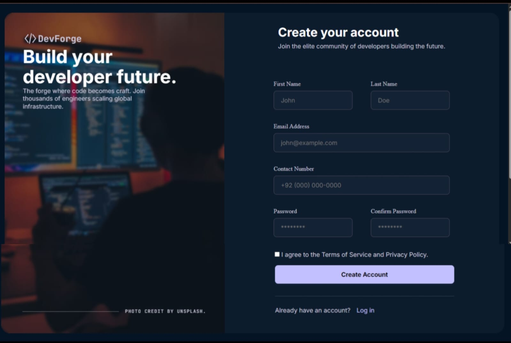

# Sign-Up Form

> A premium dark-themed developer onboarding page built as part of The Odin Project's Intermediate HTML and CSS curriculum.

---

## Overview

This project is a modern sign-up form inspired by The Odin Project's design mockup and redesigned with a premium SaaS-style developer experience. It focuses on semantic HTML, form design, typography systems, CSS variables, and professional UI practices.

The goal of this project was to practice building real-world forms using modern HTML and CSS techniques while improving layout and styling skills.

---

## Preview

- Premium two-column layout
- Developer-focused branding section
- Modern dark theme UI
- Custom design system using CSS variables
- Professional form styling and interactions

---

## Preview Output



## Features

- Semantic HTML5 structure
- Fully styled desktop sign-up form
- Dark-themed developer onboarding experience
- Custom branding (DevForge)
- Background image with overlay effect
- CSS Custom Properties (Design Tokens)
- External Google Fonts integration
- Modern typography system
- Form validation using HTML attributes
- Hover and focus states for interactive elements
- Smooth transitions and UI feedback
- Professional spacing and layout system

---

## Technologies Used

- HTML5
- CSS3
- Flexbox
- CSS Variables
- Google Fonts
- SVG Icons

---

## Design System

### Color Palette

| Purpose | Color |
|--------|--------|
| Page Background | #051424 |
| Form Background | #0D1C2D |
| Card Background | #122131 |
| Primary Color | #4F46E5 |
| Primary Light | #C3C0FF |
| Input Background | #142235 |
| Input Border | #464555 |
| Text Heading | #D4E4FA |
| Body Text | #C7C4D8 |
| Success Border | #22C55E |
| Invalid Border | #FFB4AB |

---

## Typography

### Primary Font

- Inter

### Secondary Font

- JetBrains Mono

---

## Project Structure

```text
sign-up-form/
│
├── assets/
│   └── tech-bg.avif
│
├── index.html
├── style.css
└── README.md
```

---

## Skills Practiced

### HTML

- Semantic Elements
- Forms and Inputs
- Labels and Accessibility
- HTML Validation Attributes

### CSS

- Flexbox Layouts
- CSS Variables
- Background Images
- Pseudo Elements
- Typography Systems
- Custom Color Systems
- Hover Effects
- Focus States
- Border Radius System
- Spacing System
- Shadows and Elevation
- Transitions

### Design

- UI Hierarchy
- Premium SaaS Styling
- Developer-Centric Branding
- Dark Mode Interfaces
- Component-Based Styling

---

## What I Learned

Through this project, I improved my understanding of:

- Building professional form layouts.
- Structuring scalable CSS using design tokens.
- Creating reusable typography and spacing systems.
- Working with background overlays and visual hierarchy.
- Designing modern and premium user interfaces.
- Organizing projects using clean HTML and CSS architecture.

---

## The Odin Project

This project was completed as part of:

- Intermediate HTML and CSS
- The Odin Project - Full Stack JavaScript Path

---

## Future Improvements

Possible enhancements include:

- Responsive design support.
- Password matching validation using JavaScript.
- Form submission handling.
- Accessibility improvements.
- Animation and micro-interactions.

---

## Acknowledgements

- The Odin Project
- Google Fonts
- Unsplash (background image credit)
- Inspiration from modern SaaS onboarding interfaces

---

## Author

### NoOr Ullah

- Frontend Developer
- IT Student
- Future Full-Stack Developer

GitHub:
- https://github.com/Noorullah814

---

### Built with ❤️ while learning through The Odin Project (2026)