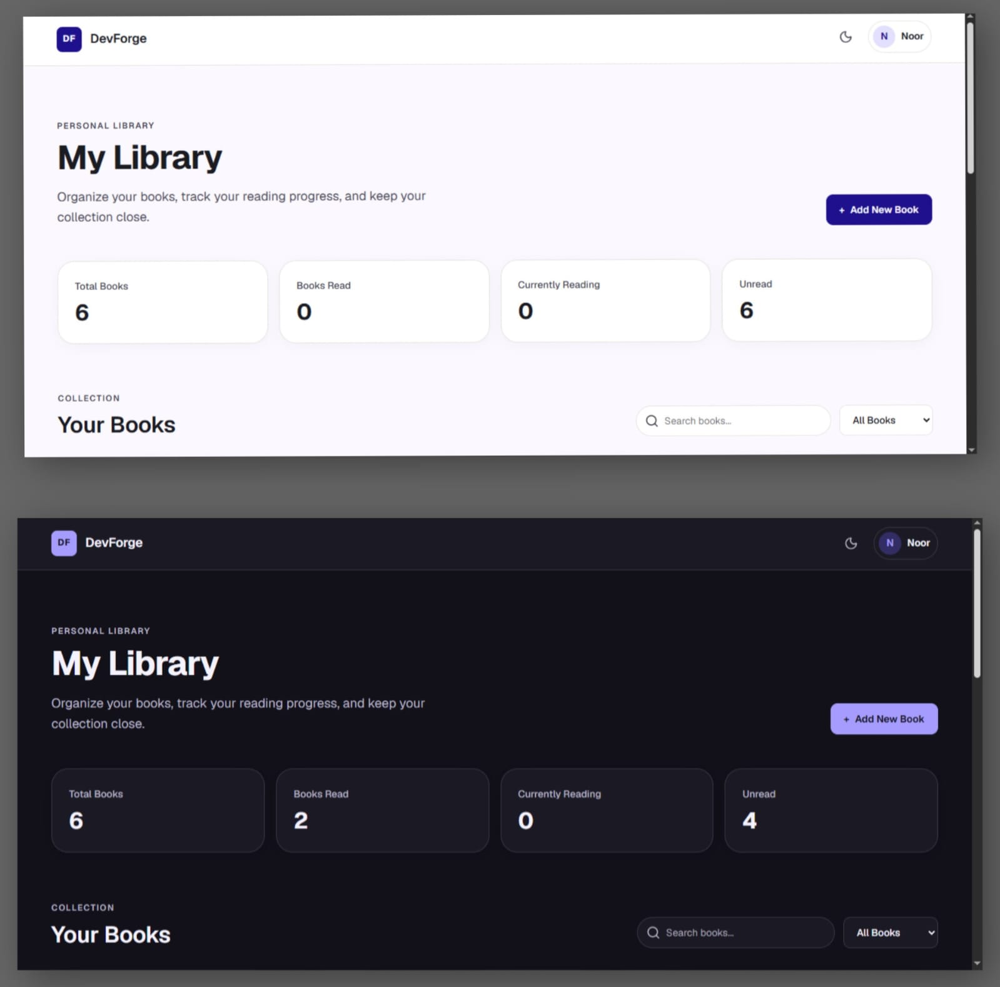
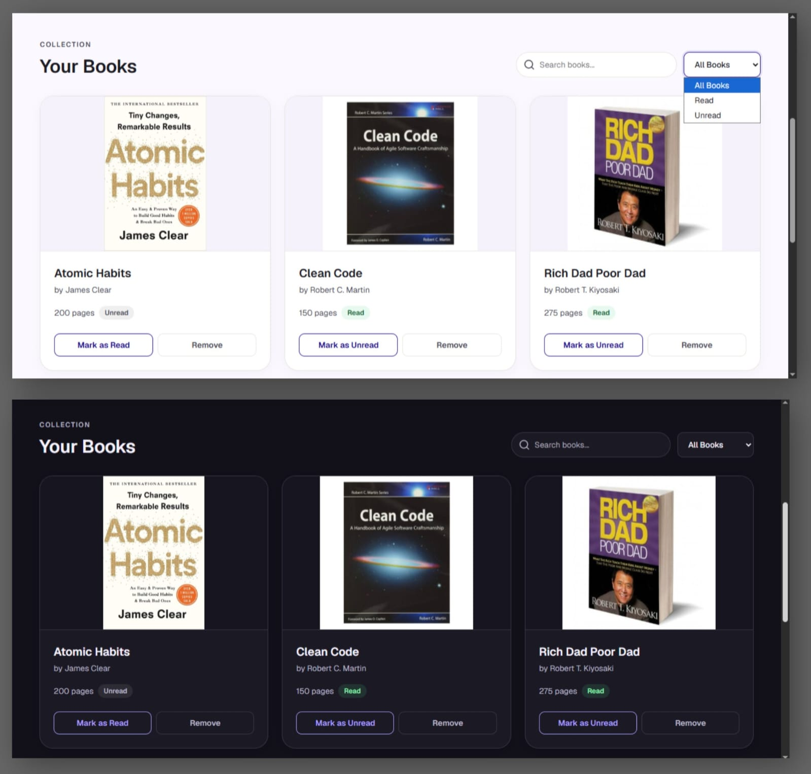
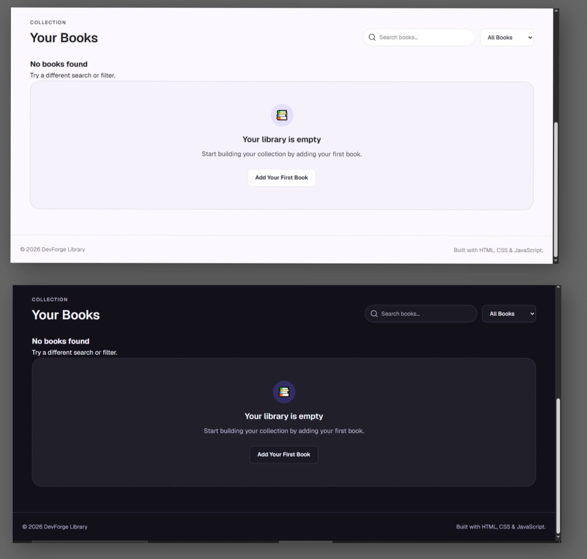

# My Library

A responsive personal library web app built with **HTML, CSS, and JavaScript**.

My Library allows users to manage a personal collection of books, track their reading status, search and filter their collection, and switch between light and dark themes.

## Preview

### 1. Library — Hero (light and dark)

### 2. Library — book collectiom (light and dark)

### 3. Library - Empty (light and dark)

## Features

- Add new books
- Select a different cover image for each book
- Remove books
- Toggle read/unread status
- Search books by title or author
- Filter books by reading status
- Library statistics
- Empty library state
- No-results state
- Form validation
- Light/dark theme
- Theme preference saved with LocalStorage
- Responsive design
- Unique ID generated for every book

## Technologies

- HTML5
- CSS3
- JavaScript
- Web APIs
- LocalStorage

## What I Practiced

- JavaScript objects and constructors
- Prototypes
- Arrays and array methods
- DOM manipulation
- Event listeners
- Event delegation
- Forms and validation
- `<dialog>` element
- `data-*` attributes
- LocalStorage
- CSS design systems and variables
- Responsive UI
- Light/dark theme implementation

## Project Requirements

This project was built to practice JavaScript objects, constructors, prototypes, DOM manipulation, event handling, and working with browser APIs.

The application stores all books in a JavaScript array and dynamically renders the library based on the current data.

## Project

This project was built as part of  
[The Odin Project](https://www.theodinproject.com/) Full Stack JavaScript curriculum.

## Author

**Noor Ullah**

GitHub: [NoOr Ullah](https://github.com/noorullah814)