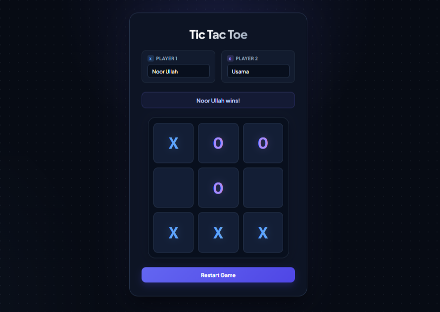

# Tic Tac Toe

A browser-based **Tic Tac Toe** game built as part of [The Odin Project](https://www.theodinproject.com/) JavaScript curriculum.

The project focuses on practicing **JavaScript objects, factory functions, IIFEs/modules, DOM manipulation, event handling, game logic, and separation of responsibilities**.

---

## 📸 Output Preview

<!-- Add your project screenshot below -->



---

## ✨ Features

* Two-player Tic Tac Toe gameplay
* Custom player names
* X and O player indicators
* Turn-based gameplay
* Automatic win detection
* Tie/draw detection
* Prevents moves on occupied squares
* Prevents moves after the game has ended
* Restart game functionality
* Responsive layout for desktop and mobile
* Interactive hover and click effects
* Clean dark-themed UI
* Dynamic board rendering using JavaScript

---

## 🛠️ Built With

* HTML5
* CSS3
* JavaScript (ES6+)
* CSS Grid
* Flexbox
* DOM Manipulation
* JavaScript Factory Functions
* JavaScript IIFEs / Module Pattern
* Git & GitHub

---

## 🧠 What I Practiced

This project was mainly focused on improving JavaScript architecture and logic rather than simply building a visual interface.

### JavaScript Concepts

* Objects
* Factory functions
* IIFEs
* Closures
* Arrays
* Functions
* Conditional logic
* Loops
* Event listeners
* Event delegation
* DOM manipulation
* Data attributes
* State management
* Game logic

### Software Design

The project separates responsibilities between different parts of the application:

```text
Gameboard
    ↓
Stores and manages the board state

Player
    ↓
Creates player objects

GameController
    ↓
Controls game flow and rules

DisplayController
    ↓
Handles DOM rendering and user interaction
```

This keeps the game logic separate from the user interface.

---

## 📂 Project Structure

```text
tic-tac-toe/
│
├── index.html
├── style.css
├── script.js
│
└── assets/
    └── preview.png
```

---

## 🎮 How to Play

1. Enter a name for Player 1.
2. Enter a name for Player 2.
3. Player 1 starts with **X**.
4. Player 2 plays with **O**.
5. Players take turns selecting an empty square.
6. The first player to get three marks in a row wins.
7. If all nine squares are filled without a winner, the game ends in a tie.
8. Click **Restart Game** to start a new round.

---

## 🏆 Winning Conditions

A player wins by getting three of their marks in:

### Horizontal

```text
X | X | X
---------
  |   |
---------
  |   |
```

### Vertical

```text
X |   |
---------
X |   |
---------
X |   |
```

### Diagonal

```text
X |   |
---------
  | X |
---------
  |   | X
```

The game checks all eight possible winning combinations after every valid move.

---

## 📱 Responsive Design

The interface is designed to work across different screen sizes.

* Desktop
* Tablet
* Mobile

On smaller screens, the player input cards automatically stack vertically and the game board scales to fit the available space.

---

## 🎨 Design

The interface uses a modern dark visual style with:

* Deep navy background
* Indigo primary accents
* Blue X marks
* Violet O marks
* Rounded cards and game cells
* Subtle shadows and glow effects
* Responsive spacing
* Interactive hover and focus states

The UI was designed with a focus on keeping the game **simple, readable, and visually polished**.

---

## 🔧 Running Locally

Clone the repository:

```bash
git clone https://github.com/NoorUllah814/the-odin-project.git
```

Navigate to the Tic Tac Toe project directory:

```bash
cd the-odin-project
```

Open `index.html` in your browser.

No dependencies or build tools are required.

---

## 📚 Project Context

This project was completed as part of **The Odin Project — Full Stack JavaScript curriculum**.

The main objective was to practice structuring JavaScript applications using objects and modules while keeping global code to a minimum.

Rather than placing all game logic directly inside DOM event handlers, the project separates:

* Board state
* Player creation
* Game rules
* Game flow
* UI rendering
* User interaction

---

## 👤 Author

**Noor Ullah**

IT Student | Frontend Developer | Full-Stack Developer in Progress

* GitHub: [@NoorUllah814](https://github.com/NoorUllah814)
* Portfolio: [noorullah814.github.io/portfolio](https://noorullah814.github.io/portfolio/)

---

## 📄 License

This project was created for educational purposes as part of The Odin Project curriculum.
