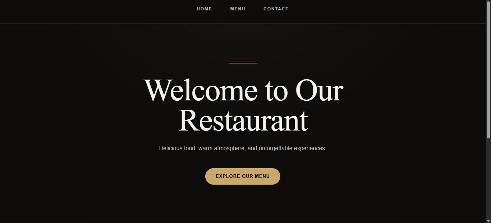
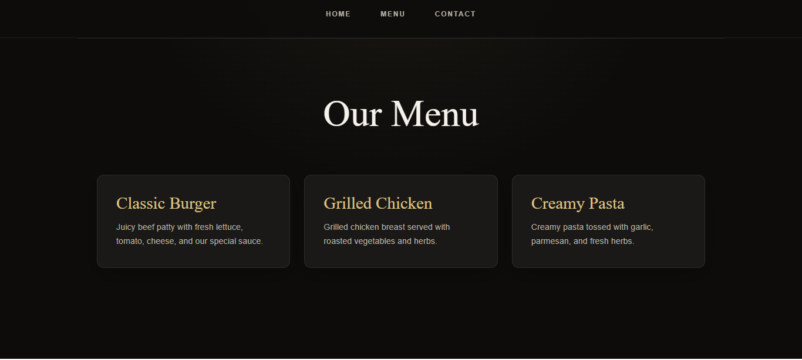

# 🍽️ Restaurant Page

A modern, responsive restaurant website built as part of **The Odin Project – JavaScript Course**.

The project focuses on using **JavaScript to dynamically generate page content**, implementing **Webpack**, modular JavaScript, tab-based navigation, and responsive CSS styling.

---

## 📸 Page Previews

### 🏠 Home

The Home page features a luxury restaurant hero section with a welcoming message, description, call-to-action button, and restaurant story.



---

### 🍴 Menu

The Menu page dynamically displays restaurant dishes using reusable menu cards with responsive layout and hover effects.



---

### 📞 Contact

The Contact page provides the restaurant's contact information with a clean and minimal layout.

---

## ✨ Features

* Dynamic page rendering using JavaScript
* Tab-based navigation
* Home, Menu, and Contact pages
* Modular JavaScript structure
* Responsive design for desktop and mobile
* Premium dark restaurant theme
* CSS variables for consistent styling
* Responsive menu card grid
* Hover effects and transitions
* Webpack development environment
* GitHub Pages deployment

---

## 🛠️ Technologies Used

* HTML5
* CSS3
* JavaScript (ES6+)
* Webpack
* Git & GitHub

---

## 📂 Project Structure

```text
03-restaurant-page/
│
├── src/
│   ├── index.js
│   ├── home.js
│   ├── menu.js
│   ├── contact.js
│   ├── style.css
│   └── template.html
│
├── .gitignore
├── package.json
├── package-lock.json
├── webpack.config.js
└── README.md
```

---

## 🧠 What I Learned

Through this project, I practiced:

* Creating DOM elements dynamically with JavaScript
* Separating page sections into JavaScript modules
* Using ES6 `import` and `export`
* Handling navigation and DOM events
* Working with Webpack
* Managing project dependencies with npm
* Creating responsive layouts with CSS Grid and Flexbox
* Using CSS variables for design consistency
* Creating responsive navigation and cards
* Deploying a Webpack project to GitHub Pages

---

## 🚀 Getting Started

### 1. Clone the repository

```bash
git clone YOUR_REPOSITORY_URL
```

### 2. Navigate to the project

```bash
cd 03-restaurant-page
```

### 3. Install dependencies

```bash
npm install
```

### 4. Start the development server

```bash
npx webpack serve
```

The project will run locally at:

```text
http://localhost:8080
```

---

## 📱 Responsive Design

The website is designed to work across different screen sizes:

* 💻 Desktop
* 📱 Mobile
* 📲 Tablet

The menu cards automatically adjust from a three-column layout to a single-column layout on smaller screens.

---

## 🎨 Design

The visual design follows a **luxury restaurant aesthetic** using:

* Dark espresso background
* Warm cream typography
* Muted gold accents
* Elegant serif headings
* Rounded cards
* Subtle borders and shadows
* Smooth hover transitions

---

## 📚 The Odin Project

This project was completed as part of **The Odin Project – JavaScript Course**.

🔗 [The Odin Project](https://www.theodinproject.com/)

---

## 👨‍💻 Author

**Noor Ullah**

IT Student & Frontend Developer

* GitHub: [NoOr Ullah](https://github.com/Noorullah814)

---

⭐ If you like the project, feel free to explore the repository and check out the other projects in my Odin Project journey.
